# dot-fullstack-batch-2 - Challenge Fullstack (Typescript)

## A. Penjelasan Project

Web simple untuk penjadwalan agenda pada ruangan.

## B. Desain Database

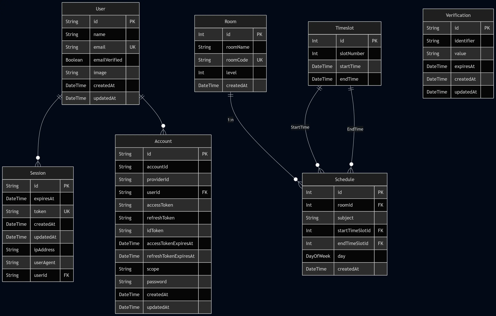

Keterangan:

- `User`, `Session`, `Account`, dan `Verification` adalah bawaan dari betterAuth.
- 1 `Room` dapat memiliki banyak atau tidak mempuyai `Schedule`.
- Setiap `Schedule` memiliki dua kolom referensi yang mengarah ke `Timeslot`.

## C. Screenshot Aplikasi

<details>
  <summary><strong>Auth</strong></summary>

| Halaman  | Gambar                              |
| :------- | :---------------------------------- |
| Login    | 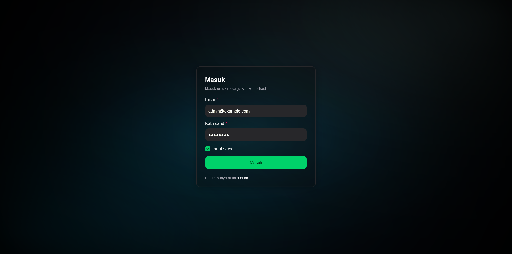       |
| Register | 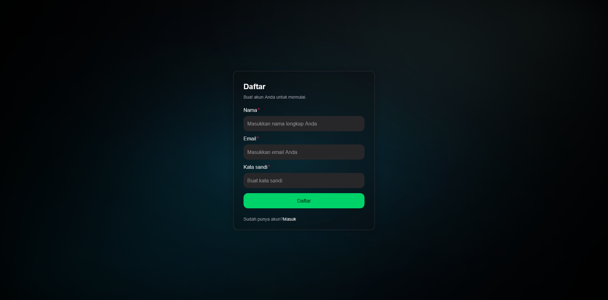 |

</details>

<details>
  <summary><strong>Home</strong></summary>

| Halaman | Gambar                      |
| :------ | :-------------------------- |
| Home    | 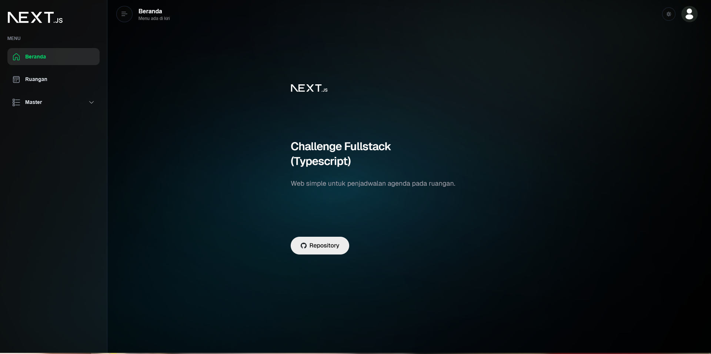 |

</details>

<details>
  <summary><strong>Room (Ruangan)</strong></summary>

| Halaman                      | Gambar                                                                  |
| :--------------------------- | :---------------------------------------------------------------------- |
| List Ruangan                 | 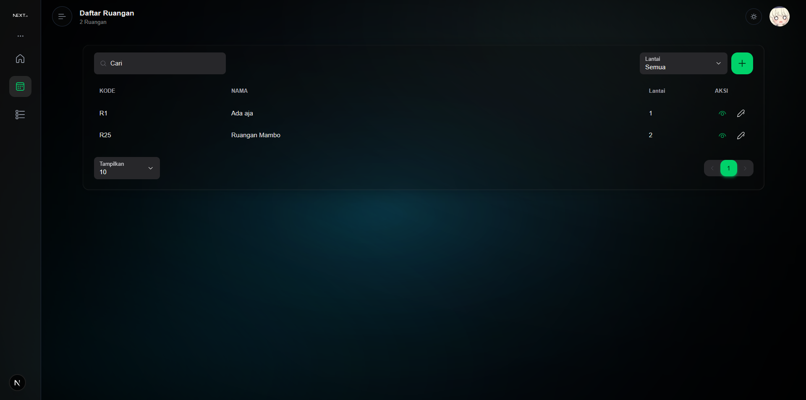                             |
| Detail Ruangan               | 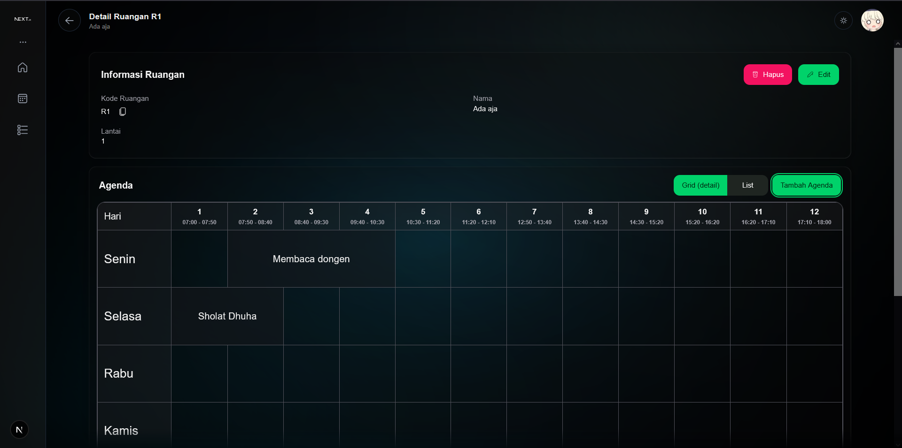                         |
| Edit Ruangan                 | 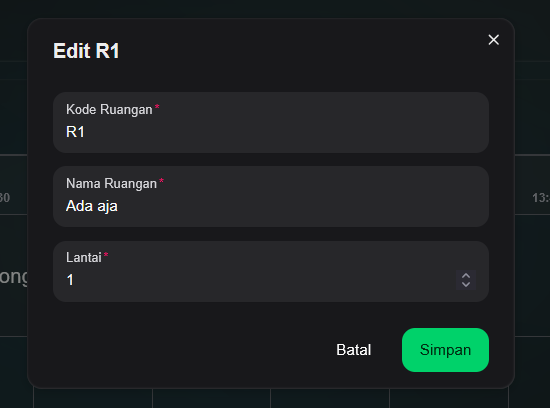                             |
| Delete Ruangan               | 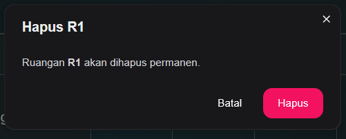                               |
| List Agenda Detail (Ruangan) | 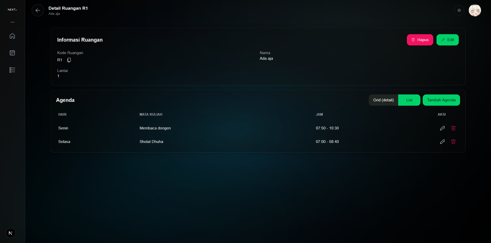 |

</details>

<details>
  <summary><strong>User</strong></summary>

| Halaman     | Gambar                                    |
| :---------- | :---------------------------------------- |
| List User   | 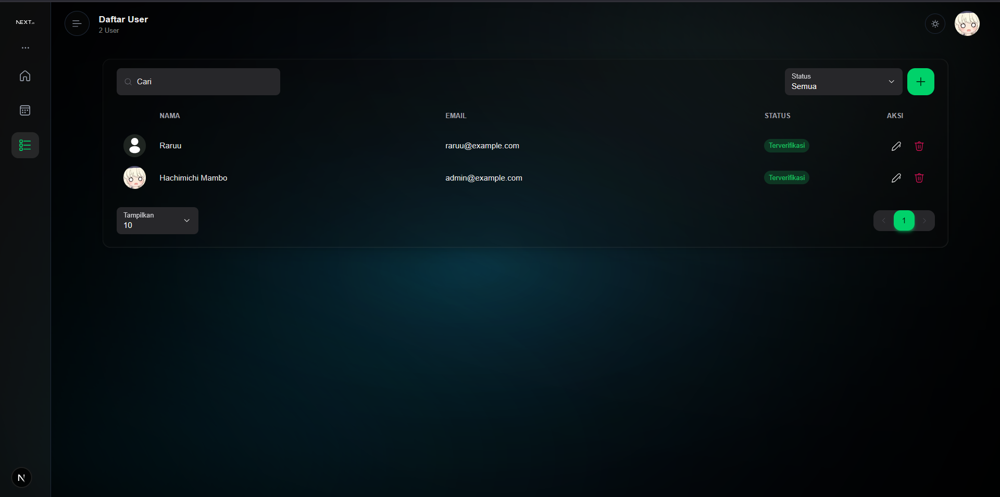     |
| Create User | 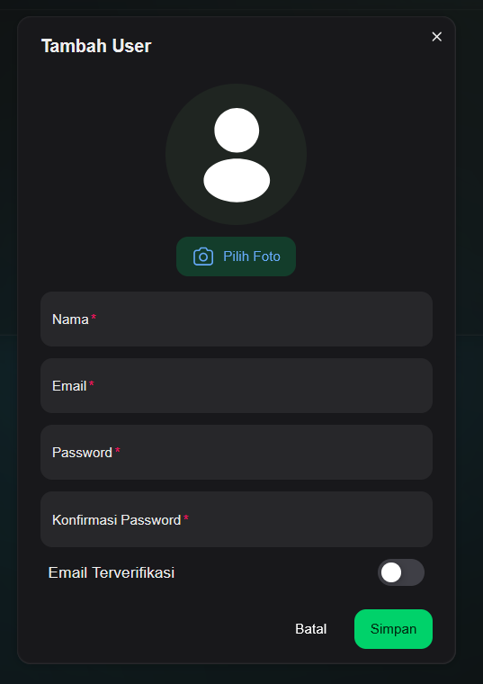 |
| Edit User   | 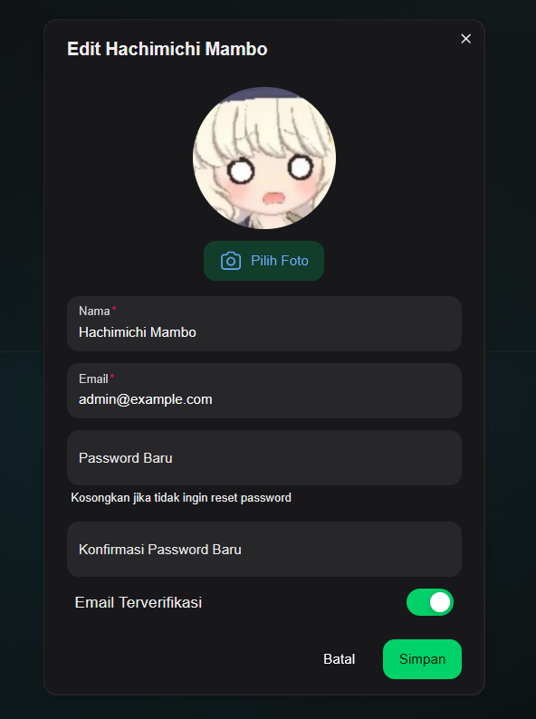     |
| Delete User | 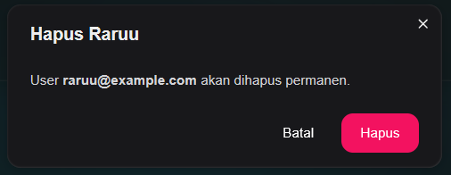 |

</details>

<details>
  <summary><strong>Agenda (Schedule)</strong></summary>

| Halaman       | Gambar                                        |
| :------------ | :-------------------------------------------- |
| Add Agenda    | 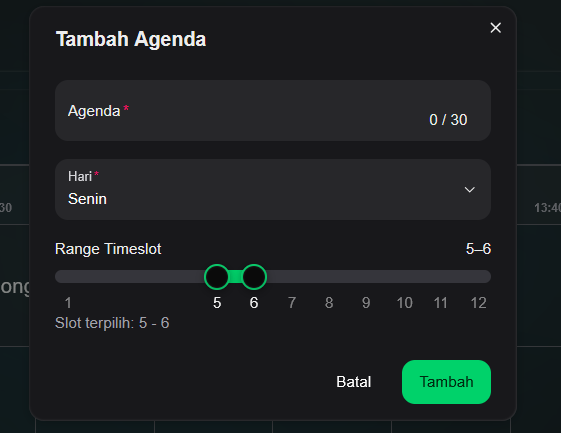       |
| Delete Agenda | 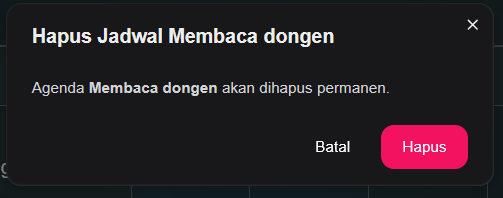 |

</details>

<details>
  <summary><strong>Bonus</strong></summary>

Light Mode <br>
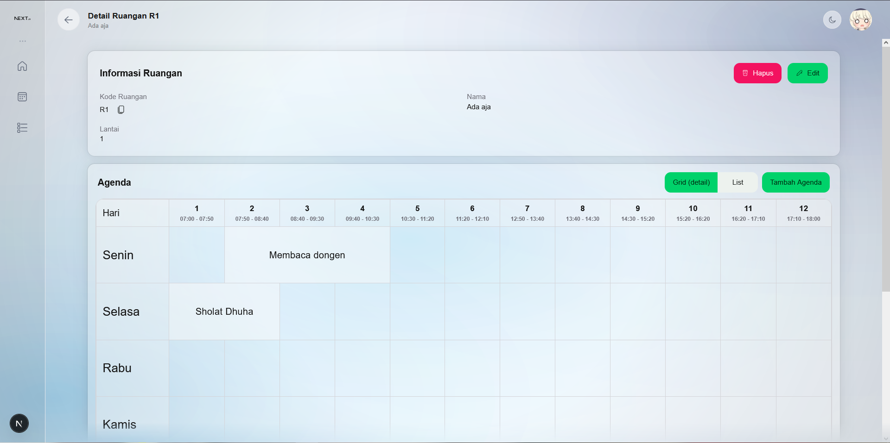

</details>

## D. Dependencies

<details>
  <summary><strong>Detail Dependencies - NestJs (package.json)</strong></summary>

| Package                        | Version   |
| :----------------------------- | :-------- |
| `@nestjs/common`               | `^11.0.1` |
| `@nestjs/core`                 | `^11.0.1` |
| `@nestjs/platform-express`     | `^11.0.1` |
| `@prisma/adapter-pg`           | `^7.7.0`  |
| `@prisma/client`               | `^7.7.0`  |
| `@thallesp/nestjs-better-auth` | `^2.6.0`  |
| `better-auth`                  | `^1.6.5`  |
| `dotenv`                       | `^17.4.2` |
| `pg`                           | `^8.20.0` |
| `reflect-metadata`             | `^0.2.2`  |
| `rxjs`                         | `^7.8.1`  |
| `sharp`                        | `^0.34.5` |
| `zod`                          | `^4.3.6`  |

### Dev Dependencies

| Package                  | Version    |
| :----------------------- | :--------- |
| `@eslint/eslintrc`       | `^3.2.0`   |
| `@eslint/js`             | `^9.18.0`  |
| `@nestjs/cli`            | `^11.0.0`  |
| `@nestjs/schematics`     | `^11.0.0`  |
| `@nestjs/testing`        | `^11.0.1`  |
| `@types/express`         | `^5.0.0`   |
| `@types/jest`            | `^30.0.0`  |
| `@types/node`            | `^24.12.2` |
| `@types/pg`              | `^8.20.0`  |
| `@types/supertest`       | `^7.0.0`   |
| `eslint`                 | `^9.18.0`  |
| `eslint-config-prettier` | `^10.0.1`  |
| `eslint-plugin-prettier` | `^5.2.2`   |
| `globals`                | `^17.0.0`  |
| `jest`                   | `^30.0.0`  |
| `prettier`               | `^3.4.2`   |
| `prisma`                 | `^7.7.0`   |
| `source-map-support`     | `^0.5.21`  |
| `supertest`              | `^7.0.0`   |
| `ts-jest`                | `^29.2.5`  |
| `ts-loader`              | `^9.5.2`   |
| `ts-node`                | `^10.9.2`  |
| `tsconfig-paths`         | `^4.2.0`   |
| `typescript`             | `^5.7.3`   |
| `typescript-eslint`      | `^8.20.0`  |

</details>

<details>
  <summary><strong>Detail Dependencies - Next.js (package.json)</strong></summary>

| Package                 | Version    |
| :---------------------- | :--------- |
| `@fluentui/react-icons` | `^2.0.324` |
| `@heroui/react`         | `^2.8.10`  |
| `@t3-oss/env-nextjs`    | `^0.13.11` |
| `better-auth`           | `^1.6.6`   |
| `dotenv`                | `^17.4.2`  |
| `motion`                | `^12.38.0` |
| `next`                  | `16.2.4`   |
| `react`                 | `19.2.4`   |
| `react-dom`             | `19.2.4`   |
| `react-easy-crop`       | `^5.5.7`   |
| `swr`                   | `^2.4.1`   |

### Dev Dependencies

| Package                | Version  |
| :--------------------- | :------- |
| `@tailwindcss/postcss` | `^4`     |
| `@types/node`          | `^20`    |
| `@types/react`         | `^19`    |
| `@types/react-dom`     | `^19`    |
| `eslint`               | `^9`     |
| `eslint-config-next`   | `16.2.4` |
| `tailwindcss`          | `^4`     |
| `typescript`           | `^5`     |

</details>

### Stack Teknologi dan Ringkasan Dependencies

| Kategori                   | Teknologi                                                                                                          | Versi                             |
| -------------------------- | ------------------------------------------------------------------------------------------------------------------ | --------------------------------- |
| **Authentication**         | [Better Auth](https://better-auth.com/)                                                                            | ^1.6.5                            |
| **Code Quality & Testing** | [ESLint](https://eslint.org/)<br>[Prettier](https://prettier.io/)<br>[Jest](https://jestjs.io/)                    | ^9 / ^9.18.0<br>^3.4.2<br>^30.0.0 |
| **Database**               | PostgreSQL (`pg`)                                                                                                  | ^8.20.0                           |
| **Framework**              | [Next.js](https://nextjs.org/)<br>[NestJS](https://nestjs.com/)                                                    | 16.2.4<br>^11.0.1                 |
| **Icons**                  | [@fluentui/react-icons](https://storybooks.fluentui.dev/react/?path=/docs/fluent-system-icons-icons-catalog--docs) | ^2.0.324                          |
| **Language**               | [TypeScript](https://www.typescriptlang.org/)                                                                      | ^5                                |
| **Media / Image**          | [Sharp](https://sharp.pixelplumbing.com/)<br>react-easy-crop                                                       | ^0.34.5<br>^5.5.7                 |
| **ORM**                    | [Prisma](https://www.prisma.io/)                                                                                   | ^7.7.0                            |
| **UI Library**             | [HeroUI v2](https://v2.heroui.com/)<br>[Motion](https://motion.dev/)<br>[Tailwind CSS](https://tailwindcss.com/)   | ^2.8.10<br>^12.38.0<br>^4         |
| **Validation & Utilities** | [Zod](https://zod.dev/)<br>[@t3-oss/env-nextjs](https://env.t3.gg/)<br>[SWR](https://swr.vercel.app/)              | ^4.3.6<br>^0.13.11<br>^2.4.1      |

## E. Informasi untuk Developer Selanjutnya

- Lihat dokumentasi pada `Dependencies` yang digunakan.
- Semua api endpoint ada pada [List dibawah ini](#api-endpoint-yang-tersedia).
- Konsep `views` sepenuhnya menggunakan Next.js.

### API Endpoint yang tersedia

| Method   | Endpoint                 | Keterangan                                                                  | Auth |
| :------- | :----------------------- | :-------------------------------------------------------------------------- | :--: |
| `*`      | `/api/auth/*`            | Endpoint bawaan Better Auth. Lihat dokumentasinya pada `api/auth/reference` |  No  |
| `GET`    | `/api/queries/rooms`     | Ambil daftar ruangan (query: `floor`, `search`, `page`, `pageSize`)         | Yes  |
| `GET`    | `/api/queries/rooms/:id` | Ambil detail ruangan berdasarkan `id`                                       | Yes  |
| `POST`   | `/api/actions/rooms`     | Tambah ruangan                                                              | Yes  |
| `PUT`    | `/api/actions/rooms`     | Ubah data ruangan                                                           | Yes  |
| `DELETE` | `/api/actions/rooms`     | Hapus ruangan                                                               | Yes  |
| `POST`   | `/api/actions/schedule`  | Tambah agenda/schedule                                                      | Yes  |
| `PUT`    | `/api/actions/schedule`  | Ubah agenda/schedule                                                        | Yes  |
| `DELETE` | `/api/actions/schedule`  | Hapus agenda/schedule                                                       | Yes  |
| `GET`    | `/api/queries/users`     | Ambil daftar user (query: `status`, `search`, `page`, `pageSize`)           | Yes  |
| `POST`   | `/api/actions/users`     | Tambah user + buat akun credential (email/password)                         | Yes  |
| `PUT`    | `/api/actions/users`     | Ubah data user (opsional reset password jika field password diisi)          | Yes  |
| `DELETE` | `/api/actions/users`     | Hapus user                                                                  | Yes  |
| `GET`    | `/api/serve/pfp/:file`   | Ambil file foto profil `.webp` dari storage                                 | Yes  |

Keterangan:

- Endpoint dengan `Auth: Yes` membutuhkan session login yang valid.
- Untuk endpoint `actions/*`, payload bisa dikirim sebagai `application/json`, `multipart/form-data`, atau `application/x-www-form-urlencoded`.

## Struktur Folder

```
dot-fullstack-batch-2/
├── prisma/
│   ├── schema.prisma          # Database schema
│   ├── seed.ts                # Database seeder
│   └── migrations/            # Database migrations
├── src/
│   ├── app/                   # Next.js App Router (Routing, Layouts, & API)
│   ├── views/
│   │   ├── components/        # Shared React components
│   │   ├── pages/             # View/pages routes
│   │   ├── hooks/             # React hooks
│   │   └── providers/         # Context providers
│   ├── controllers/           # Server actions
│   │   ├── auth/              # Authentication logic & actions
│   │   └── actions/           # Actions
│   ├── models/                # Data layer
│   │   ├── generated/         # Prisma generated
│   │   ├── queries/           # Data fetching
│   │   ├── validations/       # Validation schemas
│   │   └── db.ts              # Database connection
│   ├── libs/                  # Shared libraries
│   ├── types/                 # TypeScript type definitions
│   └── proxy.ts               # Proxy configuration
├── public/                    # Static assets
└── storage/                   # Storage folder
```

## Setup

### Prerequisites

1. **Node.js** v18+
2. **PostgreSQL** database instance

### Installation

```bash
npm install
```

### Environment Variables

Lihat `.env.example` pada masing-masing folder framework

### Setup DB Windows

```bash
npx prisma migrate reset; npx prisma db push; npx prisma generate; npx prisma db seed
```

### Setup DB Linux

```bash
npx prisma migrate reset && npx prisma db push && npx prisma generate && npx prisma db seed
```

---
